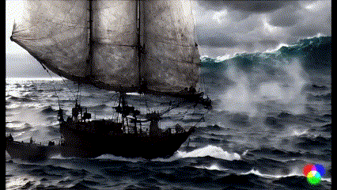

# D&D Game 

Welcome to our online Tabletop RPG, Dungeons and Dragons (D&D) game! This repository contains the resources you need to participate in our upcoming campaign, starting on June 18th, 2023. Make sure you've got your dice and character sheets ready for an epic journey!

## Getting Started

To get started, make sure you are familiar with the basics of D&D. If you need a quick refresher, check out the [Player's Handbook](https://dnd.wizards.com/products/tabletop-games/rpg-products/rpg_playershandbook).

You'll also need to get a character ready. For that, you can use the official [D&D Character Builder](https://www.dndbeyond.com/characters/builder#/), or if you prefer pen and paper, you can download a [Character Sheet](https://dnd.wizards.com/charactersheets) to fill out manually.

## Schedule

Our game will run every Sunday, starting from the 18th of June. Sessions will run from 7 PM to 9 PM. 

## Communication

We will use Discord for our game sessions. If you don't have a Discord account yet, you can sign up for one [here](https://discord.com/register). Please join our [Discord server](https://discord.gg/JKrPejPg)
## Tools

We'll be using [Roll20](https://roll20.net/) for our maps and dice rolls. Please make sure you have an account and are familiar with the basics of the tool. You can find tutorials [here](https://roll20.zendesk.com/hc/en-us/categories/360002582973-Getting-Started).

## Code of Conduct

There is no code of conduct, pirate guidelines alone. 

## Contact

If you have any questions or concerns, feel free to create an issue here on GitHub.
## Useful Links

- [D&D Basic Rules](https://dnd.wizards.com/articles/features/basicrules)
- [D&D Beyond](https://www.dndbeyond.com/)
- [Roll20](https://roll20.net/)

---
Happy Adventuring!

Thales of ballymoney
